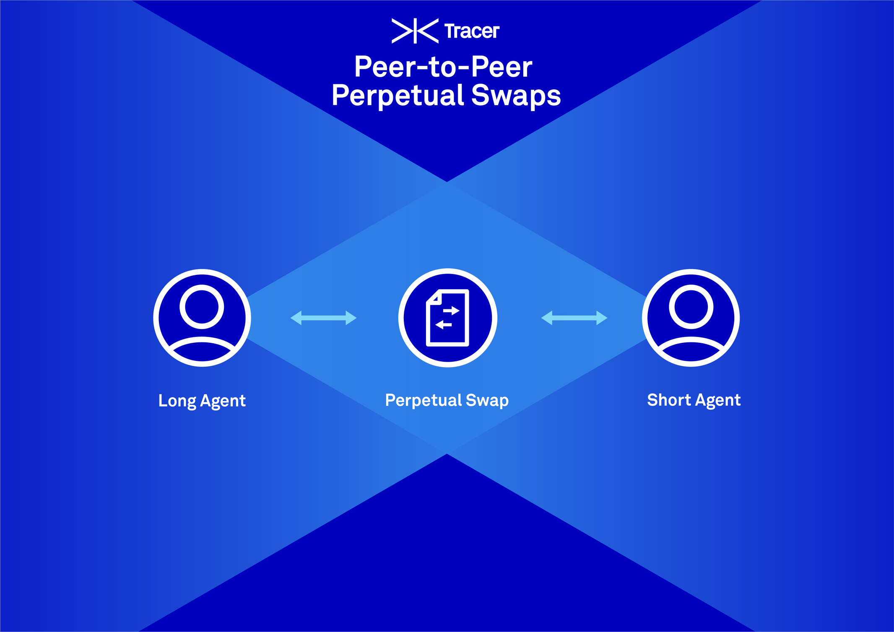

Individuals around the world lack access to global stock, commodities and other asset markets for a number of reasons. Brokerages charge high fee rates for international market access and additional licensing can prove costly and difficult to attain. Contract for difference platforms have provided a global trading experience for users, yet such platforms still suffer from third party control issues that result in market censorship. What is required is a contract type that cannot be censored and can grant the retail trader the same global financial access in a low cost, secure and instant fashion. A permissionless perpetual swap contract that can be accessed by anybody with an internet connection fits this mold. 

A perpetual swap is a financial contract that grants exposure to any market for any amount of time. Utilising a perpetual swap, trader’s can very simply go long or short at their desired leverage ratio and gain the market exposure that fits their financial beliefs. The perpetual swap contract basically emulates the experience of holding an asset or going short an asset in spot markets.

Tracer’s open-source and accessible perpetual swap framework is a way for any application or user to gain exposure to any asset at anytime. The Tracer Perpetual Swap is an entirely permissionless protocol that appropriately aligns the incentives of liquidators, oracles, liquidity providers, insurers and traders. To date, perpetual swap contracts have been engineered with centralised elements and utilise risky liquidation and insurance mechanisms that rely on third parties. Tracer’s Perpetual Swap contracts change the game and provide a more secure and reliable option.

The Tracer Perpetual Swap contract template has been engineered for traders to gain maximum exposure for minimum cost whilst experiencing the highest level of security guarantees. Anybody can permissionlessly deploy a new Perpetual Swap market with any quote and base assets. The base asset that clears and settles the agreement can be any ERC20 and the quote asset can be any derivative with an accessible price feed. If there is no price feed, then Tracer Governors or contract creators can utilise oracle financing techniques as a means of price feed discovery. Traders can either trade through a peer-to-peer order-matching mechanism or through on-chain Automated Market Maker contract (AMM). Each deployed market can have multiple AMMs with different pricing functions which have the same privileges as any other trader in the system. The first deployable AMM design is a novel delta-neutral Automated Market Maker (dnAMM) that has been engineered specifically for perpetual swaps.

Unlike traditional futures or swap contracts that expire, a perpetual swap contract allows for users to hold their position in perpetuity. This perpetual nature is permitted by the funding rate. The funding rate is a small interest rate that is paid between counter-parties to balance demand for the derivative position. The funding rate as a mechanism also balances demand for the derivative contract ensuring that it tends towards the spot price for the underlying market. If the derivative position is trading at $110 and the spot market is trading at $100 this indicates a high demand for long exposure. Based on this $10 difference known as the premium, a fee would be paid from the long party to the short party to drive the price down. The opposite would be true if the derivative price was trading below spot price. In the Tracer Perpetual Swap contract, the funding rate mechanism is open to be optimised over-time by governance.

Each Tracer Perpetual Swap market has an isolated insurance pool specific to that market allowing for liquidation risk to be localised, not putting the entire ecosystem at risk. Insurance pool depositors receive an ERC20 iToken in exchange for their deposits which are a tradable fungible claim to their insurance position. For example, if 100 USDC was deposited into a TSLA/USDC market, the insurer will receive an amount of iUSDC proportional to their share of the USDC in the insurance pool. To reclaim the 100 USDC, the insurer would burn their iUSDC. Insurers earn an Insurance Funding Rate for that is paid by traders that leverage their position. The more a trader is leveraged, the higher their insurance funding rate payments. The role of the insurer is to effectively underwrite liquidators, to ensure that they can profitably liquidate positions that are nearing bankruptcy.

## Alpha Testers
Lion’s Mane will be collecting a list of alpha tester applications and presenting it to Tracer DAO. Lion’s Mane recommends to Tracer DAO Governors that 100 initial alpha testers are chosen by the existing DAO Governors and granted 25,000 governance rights (TCR tokens) each. If an applicant is successful and refers another successful applicant, an additional 2,500 governance rights should be granted to the referee.

### Prospective Perpetual Swap Alpha Testers

- **Trader:**   Speculators and hedgers that trade through the interface will help in providing feedback on the user experience.
- **Market Maker:**   Perpetual Swaps require market makers that will provide liquidity to the order-book as well as to the system AMM's.
- **Insurer:**   Each market needs insurers so that liquidators remain profitable. People that understand risk and how to analyse risk will make valuable insurers.
- **Liquidator:**   In order for the system to remain collateralised and secure, liquidations must occur. Liquidators will run clients and profit from liquidations.
- **Oracle Expert:**   Each Perpetual Swap market requires an oracle for its funding rate, we are looking oracles and oracle experts that understand how to securely provide feeds for a contract.

Apply to be an alpha tester [here](https://tracer-finance.typeform.com/to/CLDvv8H7)

In the coming months alpha testers will be granted access to a Perpetual Swap frontend interface and asked to provide feedback on the protocol. Radical candour and honest feedback will be welcomed by the Lion’s Mane team who will be managing this process on behalf of Tracer DAO.

Stay up to date with the progression of the Tracer ecosystem here and be sure to join these community links
- [Twitter](https://twitter.com/tracer_finance)
- [Discord](https://discord.gg/kvJEwfvyrW)
- [Discourse](https://discourse.tracer.finance/)

