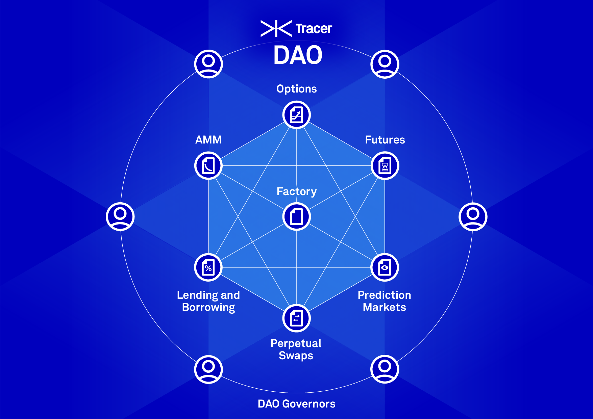
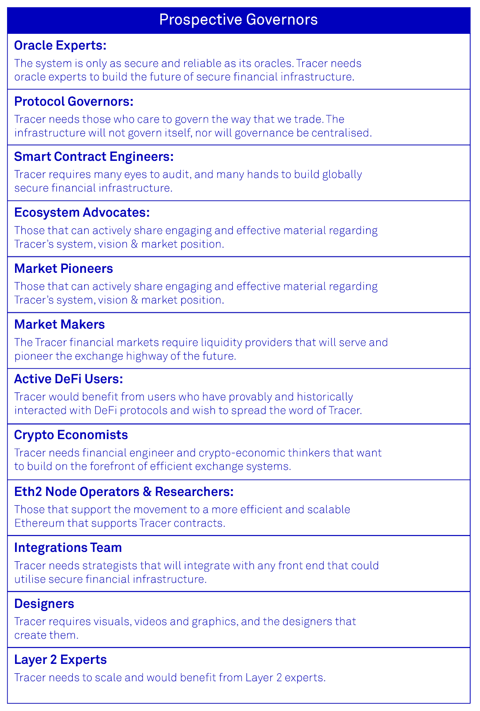

The traditional financial system is built on the back of trusted banks and institutions that facilitate transactions, provide access to markets and curate financial products. The evolution of the Internet, and efficient computing, nudged the finance industry to undergo a digital migration. This migration has allowed global finance to be conducted with progressively lower operating costs. However, the majority of finance is conducted on software that is centralised, highly insecure and prone to third party risk, which undermines the trusted institutions that use it. Blockchain technology and smart contracts allow for finance to be conducted in a highly secure and trustless environment. This technology enables not just banks, but anybody with an internet connection, to engage in globally connected, highly reliable trade.

**Tracer** is peer-to-peer financial infrastructure that leverages blockchain technology to provide censorship-resistant market connectivity; powering the next generation of finance. Tracer is decentralised by design and provides high levels of security to its users through open-source code and reliable oracle architecture. Tracer is able to host an ecosystem of financial contracts such as derivatives, lending and borrowing tools as well as spot exchanges that will support the future of financial transactions. Once a financial contract has been deployed it is entirely permissionless, unless codified otherwise.

Tracer DAO governors will be at the forefront of financial innovation and act to guide the transition from the current way we do digital finance to a more secure and scalable system. Governors will be responsible for creating and managing efficient financial tools and protocols that will become the standard financial transaction layer for the future.

### Join to Govern

There are 200 open positions for prospective Tracer governors who will be the initial governors of the ecosystem. [Lion’s Mane](https://lionsmane.dev) has been engaged (via proposal) by Tracer DAO to present candidate governors for DAO selection. Tracer DAO is looking for prospective governors and will consider nominees from the following categories:

- **Oracle Experts**   The system is only as secure and reliable as its oracles. Tracer needs oracle experts to build the future of secure financial infrastructure.
- **Protocol Governors**   Tracer needs those who care to govern the way that we trade. The infrastructure will not govern itself, nor will governance be centralised.
- **Smart Contract Engineers**   Tracer requires many eyes to audit, and many hands to build globally secure financial infrastructure.
- **Ecosystem Advocates**   Those that can actively share engaging and effective material regarding Tracer's sustem, vision & market position.
- **Market Pioneers**   Tracer needs people with innovative ideas for new markets to bring them forth.
- **Market Makers**   The Tracer financial markets require liquidity providers that will serve and pioneer the exchange highway of the future.
- **Active DeFi Users**   Tracer would benefit from users who have provably and historically interacted with DeFi protocols and wish to spread the word of Tracer.
- **Crypto Economists**   Tracer needs financial engineer and crypto-economic thinkers that want to build on the forefront of efficient exchange systems.
- **Eth2 Node Operators & Researchers**   Those that support the movement to a more efficient and scalable Ethereum that supports Tracer contracts.
- **Integrations Team**   Tracer needs strategists that will integrate with any front end that could utilise secure financial infrastructure.
- **Designers**   Tracer requires visuals, videos and graphics, and the designers that create them.
- **Layer 2 Experts**   Tracer needs to scale and would benefit from Layer 2 experts. 

<!--  -->
### Duties to the DAO

If you see yourself as an eligible candidate for Tracer DAO governance, [apply here](https://tracer-finance.typeform.com/to/zHrUFNEn).
The operation of the DAO may include:

-   Choosing to install new financial contracts to the Factory

-   Allocating TCR governance tokens to ecosystem initiatives

-   Choosing to perform liquidity mining programs.

Each decision made by Tracer DAO must be debated with rigor and objectivity. As Tracer’s success is dependent on good governance, potential governors should stay up-to-date with Tracer and its resources. [Apply now](https://tracer-finance.typeform.com/to/zHrUFNEn) and help govern the way we trade.

[Read the Tracer Whitepaper](https://tracer.finance/whitepaper)

We invite the community to join our Discord, Discourse and Twitter channels with questions regarding alpha testing and the protocol moving forward.

-   **[Discord](https://discord.gg/kvJEwfvyrW)**

-   **[Discourse](https://discourse.tracer.finance)**

-   **[Twitter](https://twitter.com/tracer_finance)**
