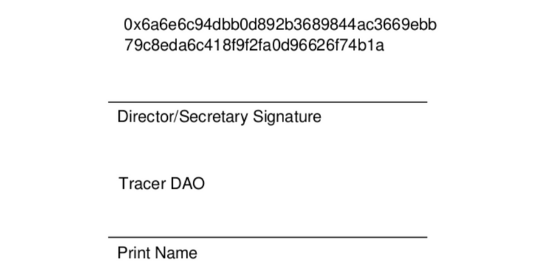

For Tracer to become secure financial infrastructure that the world can rely on, the Tracer ecosystem must include experts specialising in security. Currently, individuals place trust in a bank in exchange for a guarantee that their assets are held securely by that bank. Evolving from this traditional model of trust, trust in decentralised financial infrastructure is created through reliable oracles, cryptographic guarantees and secure smart contracts.

On this note, Tracer DAO has two significant announcements: 

- Sigma Prime has been engaged by Tracer DAO. They are conducting an initial audit on the Perpetual Swap smart contract codebase.
- Tracer DAO has executed a legal document by way of an Ethereum transaction hash, trailblazing the DAO space and legitimising the DAO as an entity. Learn more about this below.

On 19 March 2021, Tracer DAO engaged Sigma Prime through a Services Agreement, to perform a security audit of the perpetual swap contracts developed by Lion’s Mane.

The executed Service Agreement now includes a “digital signature” in the form of an [Ethereum transaction hash](https://etherscan.io/tx/0x6a6e6c94dbb0d892b3689844ac3669ebb79c8eda6c418f9f2fa0d96626f74b1a) of the successful proposal.

> Tracer DAO’s execution of its Services Agreement with Sigma Prime.
 

To the best of our knowledge, this is the first legal document to have been “signed by a DAO”. This creates precedent that Tracer DAO, and DAOs more generally, can contract directly with service providers.

#### Sigma Prime

For the Tracer ecosystem, Sigma Prime will:

- Audit the perpetual swap contracts developed by Lion’s Mane;
- Run a manual code review;
- Complete the development of a test framework to support manual review;
- Run front-end security testing;
- Conduct report preparation and quality assurance review; and
- Complete the security review and testing by 23 April 2021.

Sigma Prime are blockchain and cybersecurity experts, specialising in building Ethereum 2.0. They have an extensive history in traditional penetration testing of corporate networks, cloud infrastructure, and web/mobile applications. Sigma Prime are a leading provider of Ethereum smart contract security assessments.

Sigma Prime founded and maintain [Lighthouse](https://github.com/sigp/lighthouse), an open-source implementation of the Ethereum 2.0 specification written in Rust. Sigma Prime are heavily involved in Ethereum 2.0 engineering and research, making them an ideal team to be working with in growing Tracer.

In addition to the work for Tracer DAO, Sigma Prime has a respectable list of reputable and legitimate clients including: Ethereum Foundation, Synthetix, Chainlink, NEAR, Status, Dapper, and more.

Tracer DAO looks forward to working with Sigma Prime for an initial audit, and will be looking to work with them into the future. 

You can follow Sigma Prime on [Twitter](https://twitter.com/sigp_io) or visit their [site](https://sigmaprime.io/).
